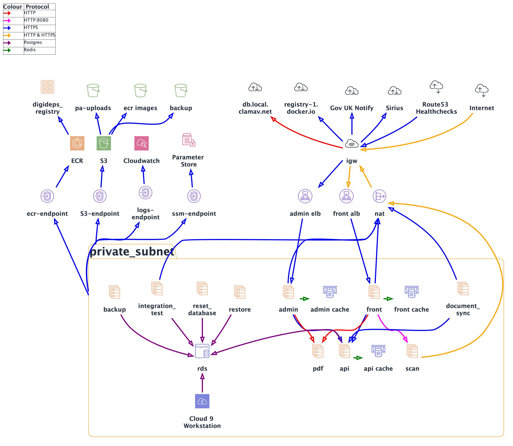

[](https://codecov.io/gh/ministryofjustice/opg-digideps)

# Complete the deputy report

This app is the [Complete the deputy report][service] service. It provides an online reporting service that has a publicly available frontend used by deputies to submit their reports, and a VPN restricted admin area for case managers to review submitted reports.

## Requirements

You must have Docker installed.

If developing the app then ensure you have [pre-commit](https://pre-commit.com/) installed to take advantage of the pre-commit [hooks](.pre-commit-config.yaml) we've added to the project to make PRs a more consistent and enjoyable experience.

> **N.B.** If you have an M1 macOS running Monterey 12.2 or higher, or you have an Intel based macOS running Monterey 12.3 or higher then there are some Docker setting you can enable which improves I/O performance for operations on volumes.

#### M1 macOS Monterey ≥ 12.2 | Intel macOS Monterey ≥ 12.3 Docker settings

* `Docker settings -> General -> make sure 'Use the new Virtualization framework' is ticked`
* `Docker settings -> General -> tick 'VirtioFS' for file sharing`
* `Docker settings -> General -> untick 'Use Rosetta'`

Also in `Docker settings -> Resources`, make sure that you have at least 10gb of memory allocated or you may get performance issues.

Once both boxes are checked click `Apply & Restart` then continue to follow the instructions below.

## Installation

- Add `127.0.0.1 digideps.local admin.digideps.local api.digideps.local www.digideps.local` to `/etc/hosts`
- Make sure you have docker desktop installed.
- Follow the instructions for creating your own self-signed certificates here: [self-signed-certificate-instructions](local-resources/local-load-balancer/certificates/certificates.md)
- Make sure you are in the root directory of this repository and run:

```
make create-app
```

This will build the app, start it up and reset the DB and install fixtures so you may not want to use this for a simple rebuild.

- If you followed all the instructions correctly you should be able to navigate to `https://digideps.local` for the frontend
and `https://admin.digideps.local` for the admin app.

### Managing your local environment

Have a read through:

```
make help
```

This is a full list of functions for administering our local environment. All information provided in the make file
should be considered the most up to date source of truth. For bringing your app back up use: `up-app` and `up-app-rebuild`
instead of `create-app` after your initial build of everything as those commands will be considerably faster.

## Traffic Flow Diagram



This diagram can be updated in `traffic_flow_diagram.puml` and then rendered to PNG using `plantuml ./docs/traffic_flow_diagram.puml -o .`.

## Terraform installation

To develop with Terraform, you must have the following installed:

- Docker
- Make
- IDE plugin for HCL/terraform
- jq
- aws-vault for credentials handling (optional)
- direnv (to set shell exports, see .envrc) (optional)

You can then use the make files in `environment` and `account` to set up the environment.

```bash
# ensure your environment is setup:
export TF_WORKSPACE=myawesomeenvironment
export TF_VAR_OPG_DOCKER_TAG=mybranch-githash
export AWS_ACCESS_KEY_ID=AKIAEXAMPLE
export AWS_SECRET_ACCESS_KEY=cbeamsglittering
cd environment
make

# alternatively, using aws-vault:
export TF_WORKSPACE=myawesomeenvironment
export TF_VAR_OPG_DOCKER_TAG=mybranch-githash
cd environment
aws-vault exec identity make
```

## Testing & Debugging

_See [testing](docs/TESTING.md)_ and [debugging ](docs/DEBUGGING.md) documentation.

## Deployment

_See [deployment documentation](docs/DEPLOYMENT.md)_

## Environment Variable

_See [managing environment variables](docs/ENVIRONMENT_VARIABLES.md)_

## Built with

- Terraform
- PHP
- Symfony
- Doctrine
- Twig
- Behat
- PHPUnit
- [GOV.UK Design System](https://design-system.service.gov.uk/)
- [GOV.UK Notify](https://notifications.service.gov.uk/)

## License

The OPG Digideps Client is released under the MIT license, a copy of which can be found in [LICENSE](LICENSE).

[service]: https://complete-deputy-report.service.gov.uk/


## Runbook


Our runbook, incident response process and other OPG technical guidance can be found [here](https://ministryofjustice.github.io/opg-technical-guidance/#opg-technical-guidance).

-- to remove - triggering build --
