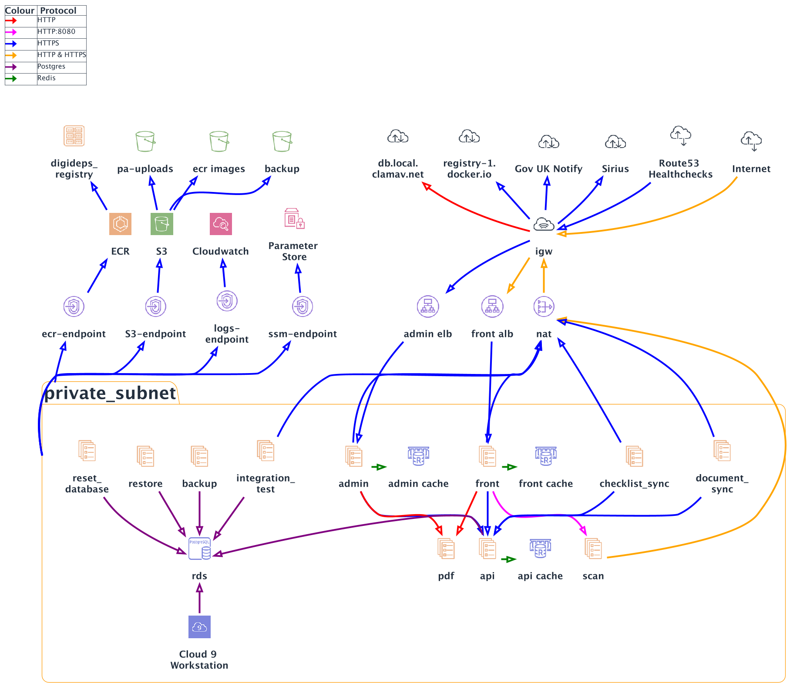

[](https://codecov.io/gh/ministryofjustice/opg-digideps)

# Complete the deputy report

This app is the [Complete the deputy report][service] service. It provides an online reporting service that has a publicly available frontend used by deputies to submit their reports, and a VPN restricted admin area for case managers to review submitted reports.

## Requirements

You must have Docker installed.

If developing the app then ensure you have [pre-commit](https://pre-commit.com/) installed to take advantage of the pre-commit [hooks](.pre-commit-config.yaml) we've added to the project to make PRs a more consistent and enjoyable experience.

> **N.B.** If you have an M1 macOS running Monterey 12.2 or higher, or you have an Intel based macOS running Monterey 12.3 or higher then there are some Docker setting you can enable which improves I/O performance for operations on volumes.

#### M1 macOS Monterey ≥ 12.2 | Intel macOS Monterey ≥ 12.3 Docker settings

* `Docker preferences -> Experimental Features -> tick 'Use the new Virtualization framework'`
* `Docker preferences -> Experimental Features -> tick 'Enable VirtioFS accelerated directory sharing'`

Once both boxes are checked click `Apply & Restart` then run the `Make` command `make up-app-build`

## Installation

- Add `127.0.0.1 digideps.local admin.digideps.local api.digideps.local www.digideps.local` to `/etc/hosts`
- Navigate to the root directory of this repository and run `make up-app`
- Check `https://digideps.local/` (Deputy area) and `https://admin.digideps.local/` (Admin area). Your browser will warn you about a self-signed certificate.
- Run `./generate_certs.sh` to populate your certs directory
    - **NB:** Once this has ran it will create a directory called `./certs` inside there are multiple `.crt` files. On a macOS system you need to add these certificates to your keychain. Use the following link if you are unsure how to do that [Adding certificate to macOS keychain](https://support.apple.com/en-gb/guide/keychain-access/kyca2431/mac)

### Reset the database

Recreate DB schema and run migrations:

```shell script
$ make reset-database
```

Wipe DB contents and re-run fixtures:

```shell script
$ make reset-fixtures
```

## Traffic Flow Diagram



This diagram can be updated in `traffic_flow_diagram.puml` and then rendered to PNG using `plantuml ./docs/traffic_flow_diagram.puml -o .`.

## Terraform installation

To develop with Terraform, you must have the following installed:

- Docker
- Make
- terraform-docs
- jq
- aws-vault for credentials handling (optional)
- direnv (to set shell exports, see .envrc) (optional)

You can then use the make files in `environment` and `shared` to set up the environment.

```bash
# ensure your environment is setup:
export TF_WORKSPACE=myawesomeenvironment
export TF_VAR_OPG_DOCKER_TAG=mybranch-githash
export AWS_ACCESS_KEY_ID=AKIAEXAMPLE
export AWS_SECRET_ACCESS_KEY=cbeamsglittering
cd environment
make

# alternatively, using aws-vault:
export TF_WORKSPACE=myawesomeenvironment
export TF_VAR_OPG_DOCKER_TAG=mybranch-githash
cd environment
aws-vault exec identity make
```

## Testing & Debugging

_See [testing](docs/TESTING.md)_ and [debugging ](docs/DEBUGGING.md) documentation.

## Deployment

_See [deployment documentation](docs/DEPLOYMENT.md)_

## Built with

- Terraform 1.0.0
- PHP 8.0
- Symfony 4.4
- Doctrine 3.0
- Twig
- Behat 3
- PHPUnit 9
- [GOV.UK Design System](https://design-system.service.gov.uk/)
- [GOV.UK Notify](https://notifications.service.gov.uk/)

## License

The OPG Digideps Client is released under the MIT license, a copy of which can be found in [LICENSE](LICENSE)..

[service]: https://complete-deputy-report.service.gov.uk/

## Runbook

Our runbook, incident response process and other OPG technical guidance can be found [here](https://ministryofjustice.github.io/opg-technical-guidance/#opg-technical-guidance).
