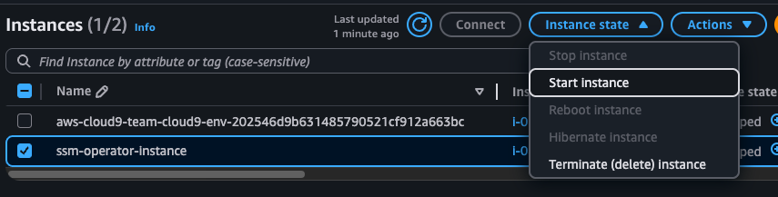
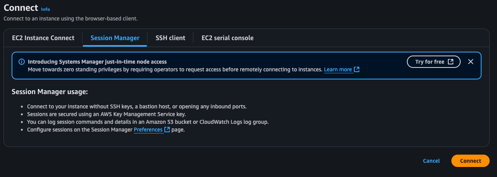
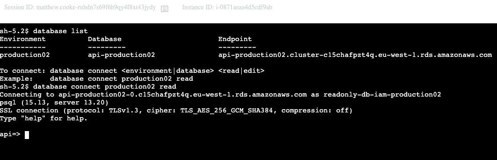

# The SSM EC2 Instance and how to Connect to The DataBase

## Overview

In the maintenance of this service, it is sometimes necessary for engineers to connect to the production (or any lower environment) database or access other service components such as S3 or Redis. Access to the database and other components is highly restrictive, requiring a number of security steps, most of which are automated for the convenience of the engineers.

First, you will need to have Operator privileges associated with an active MFA account and a strong password. Then, you will connect to the SSM instance, where you will need to retrieve the correct credentials using IAM authentication before enabling access to a PSQL terminal to connect to the database. AWS commands can be used to access S3 and other AWS resources when connected to the SSM instance.


## Connecting to the SSM Instance

The SSM instance is simply an EC2 instance with associated Operator role privileges. To connect, make sure you're in the right AWS account and in the `eu-west-1` region (Ireland). Then head over to the [EC2 instances](https://eu-west-1.console.aws.amazon.com/ec2/home?region=eu-west-1#Instances:v=3;$case=tags:true%5C,client:false;$regex=tags:false%5C,client:false) page. Make sure the filter for running instances is off, or you won't see it.

Click on the `ssm-operator-instance`, go to **Instance State** at the top right of the screen, and click **Start Instance**:



The instance will take a couple of seconds to load. If it turns off again shortly after it has booted, turn it back on. You may need to refresh a couple of times before the instance state shows as **running**. Once the instance is running, click on the instance again and select **Connect**, then choose **Session Manager**, and then click **Connect** again:



It should now open a new tab in your browser with the Session Manager shell terminal. Here, you can run any AWS command associated with your privileges, such as `aws s3 ls` to list buckets, or, importantly, to connect to the database. Please note that this instance will shut down every midnight if there is no active running SSM session.

## Connecting to the Database

There are two levels of access: `read` and `edit`. The Operator role only has read privileges in the higher environments and can only connect using the heavily monitored read only user. In lower environments, the Operator role can retrieve the edit credentials for the database and gain edit privileges.

To check what databases are in the account, run the command:

```
database list
```

This will display all of the databases and their endpoints. To connect to a database, simply run:

```
database connect <environment|database> <read|edit>
```

For example:

```
database connect production02 read
```



Read access uses IAM authentication, where your role assumes into a role associated with that database before creating temporary credentials that are passed back to the SSM session without the engineer having any visibility over the credentials. Everything you do on the instance will be heavily monitored, including all `SELECT` statements and any suspicious activity. Edit access is more restricted and requires access to the database secrets in the account. This is restricted in higher environments, but in lower environments, it will automatically retrieve the password from Secrets Manager and pass it through to the `psql` connect command.
